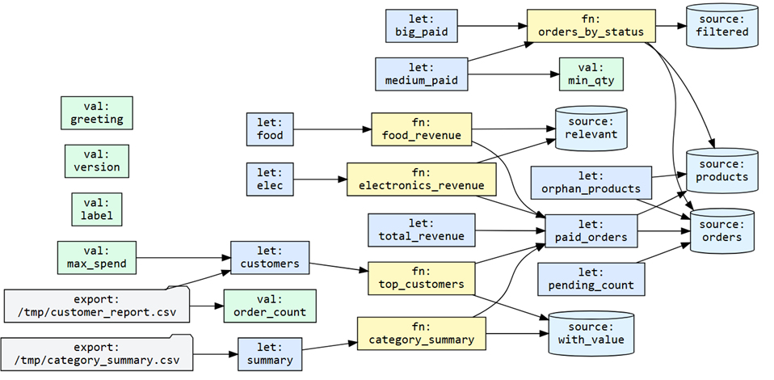

# Dabble

> **If it dabbles like a duck, it's probably Dabble.**

Dabble is a lightweight scripting layer for DuckDB.

It adds:
- scalar and table variables
- loops and control flow
- reusable functions
- named column projections
- data quality assertions
- progress tracking

…without leaving SQL.

DuckDB is still the engine you drive with. Dabble is just the gearbox that gives you the controls to sequence it. It aims to be lightweight, fast, and pleasant to read and write.

---

> ⚠️ **This is still an experimental project**, although already useful. Please do not use it in production, critical pipelines, or anywhere that matters. It will probably eat your data, steal the breadcrumbs, and leave wet duck tracks on the floor.

---

## Install

Requires CMake 3.20+ and a C++20 compiler. DuckDB is downloaded automatically.

```bash
git clone https://github.com/hiutalemedia/dabble
cd dabble
cmake -B build
cmake --build build -j
```

Run a script:

```bash
./build/bin/dabble myscript.dabble
./build/bin/dabble --verbose myscript.dabble      # show execution trace
./build/bin/dabble --progress myscript.dabble     # show progress bar
./build/bin/dabble myscript.dabble month=2026-04  # pass parameters
```

Scripts use the `.dabble` extension. A VS Code syntax highlighting extension is included in `vscode-dabble/` — copy it to `~/.vscode/extensions/` and restart.

---

## Language Reference

Comments are `--`. Indentation is 4 spaces. Scripts are plain text files.

---

### Tables — `let` / `table`

Materialises a query into a DuckDB temp table. Lives for the duration of the script.

```sql
-- Table functions work directly — no SELECT * FROM needed:
let data    = read_csv('mydata.csv')
let events  = read_parquet('s3://bucket/events/*.parquet')
let records = read_json('records.json')

-- Full queries:
let paid = orders WHERE status = 'paid'

let report =
    SELECT o.*, p.name, p.category
    FROM orders o
    JOIN products p ON p.id = o.product_id
    WHERE o.status = 'paid'
    ORDER BY o.id
```

`let` and `table` are aliases. Multi-line queries use indentation — no semicolon needed inside `let` bodies.

Bare table name on its own line prints the full table:
```sql
let summary = my_fn()
summary          -- shorthand for SELECT * FROM summary
```

---

### Scalars — `val` / `scalar`

Stores a single typed value via DuckDB `SET VARIABLE`. The original type (`DATE`, `DECIMAL`, `INTERVAL`, `VARCHAR[]`, etc.) is fully preserved — no string casting, no quoting surprises.

```sql
val threshold  = 500
val cutoff     = CURRENT_DATE - INTERVAL 30 DAYS
val label      = STRFTIME(CURRENT_DATE, '%Y-%m')
scalar greeting = 'hello'
val total       = SELECT SUM(price * qty) FROM paid
val top_region  = SELECT region FROM sales ORDER BY revenue DESC LIMIT 1
```

`val` and `scalar` are aliases. Only write `SELECT` when you need a `FROM` clause.

**Two substitution modes:**

```sql
val status   = 'paid'
val fragment = 'LEFT JOIN products p ON p.id = o.product_id'

-- Bare name: typed runtime value via getvariable() — type-safe
SELECT * FROM orders WHERE status = status

-- {{name}}: raw string injection — for dynamic SQL construction
SELECT o.customer, SUM(o.qty * p.price)
FROM orders o
{{fragment}}
WHERE o.status = '{{status}}'
GROUP BY o.customer
```

**FROM inference** — when a column exists in exactly one known `let` table, `FROM` can be omitted:

```sql
let paid = SELECT * FROM orders WHERE status = 'paid'

val total = SUM(amount)       -- 'amount' found uniquely in 'paid' → inferred
if (SUM(amount) > 1000):      -- same inference
if (total > 1000):            -- total is a scalar, no FROM needed at all
```

---

### Functions — `fn`

Functions build a self-contained CTE chain and return the last `SELECT`. They never touch the database until called. Parameters are bound as typed scalars.

```sql
fn orders_by_status(status, min_qty):
    let filtered = SELECT o.*, p.name AS product_name, p.price
        FROM orders o JOIN products p ON p.id = o.product_id
        WHERE o.status = status AND o.qty >= min_qty
    SELECT product_name, qty, ROUND(qty * price, 2) AS total
    FROM filtered
    ORDER BY total DESC

-- Materialise with args:
let big_paid = orders_by_status('paid', 5)

-- Call directly and print:
orders_by_status('refunded', 1)

-- Args can be expressions or outer-scope scalars:
val min = 3
let medium = orders_by_status('paid', min)
```

`let` inside a function becomes a CTE — compiled to a single `WITH` chain. `val` inside a function is scoped and dropped on return.

---

### Projections — `projection` / `proj` / `cols` / `columns`

Named, reusable column lists. Spread anywhere in a `SELECT` with `...name`.

```sql
projection deal_core =
    deal_id,
    rep_name,
    region,
    ROUND(amount, 2) AS amount,
    close_date

proj metrics =
    ROUND(margin_pct, 1) AS margin_pct,
    deal_tier,
    is_won

cols rep_stats =
    rep_name,
    team,
    COUNT(*) FILTER (WHERE is_won = 1)               AS won_deals,
    ROUND(SUM(amount) FILTER (WHERE is_won = 1), 0)  AS won_revenue,
    ROUND(AVG(is_won) * 100, 1)                      AS win_rate

-- Spread into any query:
let report  = SELECT ...deal_core, region FROM enriched ORDER BY close_date
let full    = SELECT ...deal_core, ...metrics FROM enriched
let exports = SELECT ...deal_core, product_category FROM enriched WHERE is_won = 1

-- In a function:
fn leaderboard():
    SELECT ...rep_stats, ROUND(AVG(margin_pct), 1) AS avg_margin
    FROM enriched GROUP BY rep_name, team ORDER BY won_revenue DESC
```

All four keywords are aliases. Projection column lists can contain `{{vars}}` resolved at definition time.

---

### For loops — `for`

Iterates over every row of a table, inline query, or column shorthand.

```sql
-- Standard loop:
for c in customers:
    print '{{c.name}} spent ${{c.total}}'

-- table.column shorthand — single-column, var IS the value:
for name in customers.name:
    print name || ' (' || UPPER(name) || ')'

-- Inline query as source:
for row in (SELECT region, SUM(revenue) AS rev FROM summary GROUP BY region):
    print '{{row.region}}: $' || ROUND(row.rev, 2)
```

---

### If / Else — `if`

Any SQL expression, evaluated by DuckDB. `SELECT` is always optional.

```sql
if (total > 1000):
    print 'big month'
else if (total > 500):
    print 'decent month'
else:
    print 'rough month'

if (COUNT(*) > 0 FROM orders WHERE status = 'pending'):
    print 'pending orders exist'
```

---

### While — `while`

```sql
CREATE TEMP TABLE counter (n INTEGER);
INSERT INTO counter VALUES (10);

while (SELECT n > 0 FROM counter):
    print SELECT 'tick: ' || n FROM counter
    UPDATE counter SET n = n - 1;
```

Scalars can drive the loop — reassigning `val offset = offset + batch_size` updates the variable each iteration.

---

### Expect / Check — `expect` / `check`

Data quality assertions. `fail` exits with a red error. `warn` prints yellow and continues. `check` and `expect` are aliases.

```sql
check  (COUNT(*) > 0 FROM paid)                   else fail 'no paid orders'
expect (COUNT(*) = 0 FROM dupes)                  else fail 'duplicates found'
check  (SUM(amount) > 0 FROM ledger)              else warn 'ledger is zero'
expect (MAX(created_at) > CURRENT_DATE - INTERVAL 1 DAY FROM events)
    else warn 'no events in last 24 hours'
```

---

### Print — `print`

```sql
print 'hello world'
print total                             -- scalar variable
print 'revenue: ${{total}}'            -- string interpolation
print 'revenue: $' || total            -- expression
print SELECT * FROM summary            -- full result set (multi-row)
print SELECT COUNT(*) FROM orders      -- single value
print SELECT                           -- multi-line
    'orders: ' || COUNT(*) ||
    ' revenue: $' || SUM(amount)
FROM paid
```

---

### Export — `->` and `>>`

```sql
SELECT * FROM summary ORDER BY revenue DESC -> report.csv
SELECT * FROM errors >> error_log.csv          -- append mode

-- Dynamic filename from scalar:
val label = STRFTIME(CURRENT_DATE, '%Y-%m')
SELECT * FROM summary -> reports/summary_{{label}}.csv

-- Named table shorthand:
leaderboard -> reports/leaderboard.csv
```

---

### CLI arguments & environment variables

Pass `key=value` pairs after the script path — available inside scripts as `env.key`:

```bash
dabble pipeline.dabble month=2026-04 region=EMEA min_deal=1000
```

```sql
val month  = COALESCE(TRY_CAST(env.month AS DATE), CURRENT_DATE)
val region = env.region          -- empty string if not passed
val limit  = COALESCE(TRY_CAST(env.min_deal AS INTEGER), 500)

let deals = SELECT * FROM orders
    WHERE close_date >= month
    AND (region = '' OR UPPER(area) = UPPER(region))
    AND amount >= limit
```

System environment variables work the same way: `env.HOME`, `env.MY_SECRET`, etc.

---

### Import — `import`

Runs another Dabble file in the current context. Paths resolve relative to the importing file, so imports work regardless of working directory.

```sql
import "lib/projections.dabble"
import "config.dabble"
```

---

### Progress — `--progress`

```bash
# Human-readable animated bar on stderr:
./dabble --progress pipeline.dabble

# Machine-readable structured lines — for calling from another program:
./dabble --progress pipeline.dabble 2>progress.log
```

Machine mode (when stderr is not a tty) emits:
```
PROGRESS 1/24 let raw_deals
PROGRESS 2/24 let products
PROGRESS 3/24 for row (245/10000)
PROGRESS DONE
```

Easy to parse from any language:
```python
proc = subprocess.Popen(['dabble', '--progress', 'pipeline.dabble'],
                        stderr=subprocess.PIPE)
for line in proc.stderr:
    if line.startswith(b'PROGRESS'):
        parts = line.split()
        cur, tot = map(int, parts[1].split(b'/'))
        update_progress_bar(cur / tot)
```

---

### Statement termination

Multi-line raw SQL at the top level needs a semicolon. Inside `let`, `val`, and `fn` bodies, indentation handles termination automatically.

```sql
-- Top level: semicolon needed when one raw statement follows another
INSERT INTO log VALUES (now(), 'ran');
SELECT * FROM log;

-- Single raw statement followed by a Dabble keyword: semicolon optional
SELECT * FROM summary
let next = SELECT 1    -- Dabble keyword terminates the SELECT above

-- Inside let/fn bodies: indentation terminates, no semicolons needed
let report =
    SELECT o.*, p.name
    FROM orders o
    JOIN products p ON p.id = o.product_id
    WHERE o.status = 'paid'
```

---

### Persistent databases

Dabble runs in-memory by default. To use a persistent DuckDB database, add these two lines at the top of your script — it's plain DuckDB SQL, no special Dabble syntax needed:

```sql
ATTACH 'mydata.duckdb' AS mydb;
USE mydb;

-- all lets, fns, vals now operate against mydata.duckdb
let users = SELECT * FROM users WHERE active = true
val total = SELECT COUNT(*) FROM orders

-- query across multiple attached databases:
ATTACH 'archive.duckdb' AS archive;
let combined = SELECT * FROM orders UNION ALL SELECT * FROM archive.orders
```

Since Dabble passes raw SQL straight through to DuckDB, any DuckDB feature works at the top of a script: `ATTACH`, `INSTALL`, `LOAD`, `SET`, `CREATE SECRET`, etc.

---

## How it works

Dabble compiles your script to an AST, then walks it. Each statement is either:

- **Handed directly to DuckDB** — raw SQL, `let`, `val`, redirects
- **Used to drive iteration** — `for` fetches rows and loops, `while` re-evaluates each pass
- **Built into a CTE chain** — `let` and `val` inside `fn` bodies are lazy, compiled to a single `WITH` chain DuckDB optimises as one query

There is no expression evaluator, no type system, no query planner. DuckDB handles all of that. Dabble's entire job is sequencing.

---


### Dependency analysis — `--deps`

Analyze the dependency graph of a script without executing it. Useful for understanding data lineage, planning changes, and answering "if I change X, what breaks?"

```bash
# Full graph — all nodes and their dependencies
dabble --deps pipeline.dabble

# What does changing this projection affect? (downstream)
dabble --deps --changed=projection:deal_core pipeline.dabble

# What does let:summary depend on? (upstream)
dabble --deps --upstream=let:summary pipeline.dabble

# Where did the data in this table originally come from?
dabble --deps --sources=let:enriched pipeline.dabble

# Which CSV exports does this flow into?
dabble --deps --destinations=let:paid pipeline.dabble

# Export as Graphviz DOT — pipe to dot for an SVG diagram
dabble --deps --format=dot pipeline.dabble | dot -Tsvg > graph.svg

# Export as JSON — store lineage, query with DuckDB
dabble --deps --format=json pipeline.dabble > lineage.json
duckdb -c "SELECT name, kind FROM read_json('lineage.json').nodes WHERE kind = 'export'"
```

The dependency graph tracks: `let` tables, `val` scalars, `fn` functions, `projection` column sets, external data sources (`read_csv`, `read_parquet`, etc.), raw SQL mutations (`UPDATE`, `INSERT`, `DELETE`), and file exports (`->`).

Dependency analysis never executes the script — it only parses. Cold start is practically instant.

Example using --format=dot

---

## What Dabble actually sends to DuckDB

Dabble is transparent by design. Here is a script and the SQL it generates:

```sql
val cutoff = CURRENT_DATE - INTERVAL 30 DAYS
val avg    = SELECT AVG(amount) FROM orders WHERE status = 'paid'

fn recent_summary():
    let paid   = SELECT * FROM orders WHERE status = 'paid' AND created_at > cutoff
    let ranked = SELECT customer_id, SUM(amount) AS total FROM paid GROUP BY customer_id
    SELECT * FROM ranked WHERE total > avg ORDER BY total DESC

let summary = recent_summary()
check (COUNT(*) > 0 FROM summary) else fail 'no customers above average'

for row in summary:
    print '{{row.customer_id}} — $' || ROUND(row.total, 2)
```

**What DuckDB receives:**

```sql
-- val cutoff
SET VARIABLE __val_0_cutoff = (SELECT (CURRENT_DATE - INTERVAL 30 DAYS));

-- val avg
SET VARIABLE __val_0_avg = (SELECT AVG(amount) FROM orders WHERE status = 'paid');

-- let summary = recent_summary()
-- Function body produced zero queries. lets became CTEs, scalars inject as getvariable().
CREATE OR REPLACE TEMP TABLE summary AS (
    WITH paid AS (
        SELECT * FROM orders
        WHERE status = 'paid'
        AND created_at > getvariable('__val_0_cutoff')
    ),
    ranked AS (
        SELECT customer_id, SUM(amount) AS total
        FROM paid GROUP BY customer_id
    )
    SELECT * FROM ranked
    WHERE total > getvariable('__val_0_avg')
    ORDER BY total DESC
);

-- check
SELECT 1 FROM (SELECT (COUNT(*)) AS _cond FROM summary) WHERE _cond IS TRUE LIMIT 1;

-- for row in summary: print ...
SELECT ('alice' || ' — $' || ROUND(312.50, 2));
SELECT ('bob'   || ' — $' || ROUND(274.00, 2));
```

Key things to notice:
- The function compiled to **one query**, regardless of how many `let` statements were inside it
- Scalars inject as `getvariable()` — typed, not strings — so date math, comparisons, and arithmetic all work correctly
- Dabble itself evaluates nothing. Every number, date, and comparison goes through DuckDB

---

## What Dabble intentionally is not

- **Not a general scripting language.** No file I/O beyond CSV/parquet, no HTTP, no string manipulation outside SQL.
- **Not a Python replacement.** If you need pandas, ML, or complex application logic — use Python. Dabble is for the part of your pipeline that is already pure SQL logic.
- **Not production-ready.** The language is still evolving. Things will change.
- **Not an ORM.** Dabble doesn't know what a model is.

---

## Roadmap / known gaps

- [ ] Better indentation handling (currently hardcoded 4 spaces — tabs unsupported)
- [ ] `return` for early exit from functions
- [ ] Package/module system beyond `import`
- [ ] Function return type inference (scalar vs table)

---

## License

MIT. Do whatever you want, just don't blame the duck.
